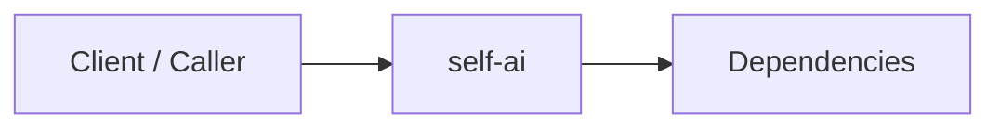

# Self Ai Manual

This manual provides operational and architectural context for `self-ai`. It complements the service README and is intended to stay current as capabilities evolve.

## Purpose
- Describe why the service exists and the problems it solves.
- Clarify the service's boundaries so the overall system stays agnostic and modular.

## Responsibilities
- TBD (add concrete responsibilities here).

## Not Responsibilities
- TBD (add explicit non-goals here).

## Interfaces
- README: `./README.md`
- API/Contracts: TBD (link to proto/schema/spec files).

## Availability And Gaps
| Area | Status | Notes |
| --- | --- | --- |
| Core features | TBD | Audit required |
| Observability | TBD | Audit required |
| Operations | TBD | Audit required |

## Diagrams

## Runbook Notes
- TBD (startup, config, migrations, scaling, failure modes).

## Maintenance
- Last reviewed: 2026-02-08
- Owner: TBD
